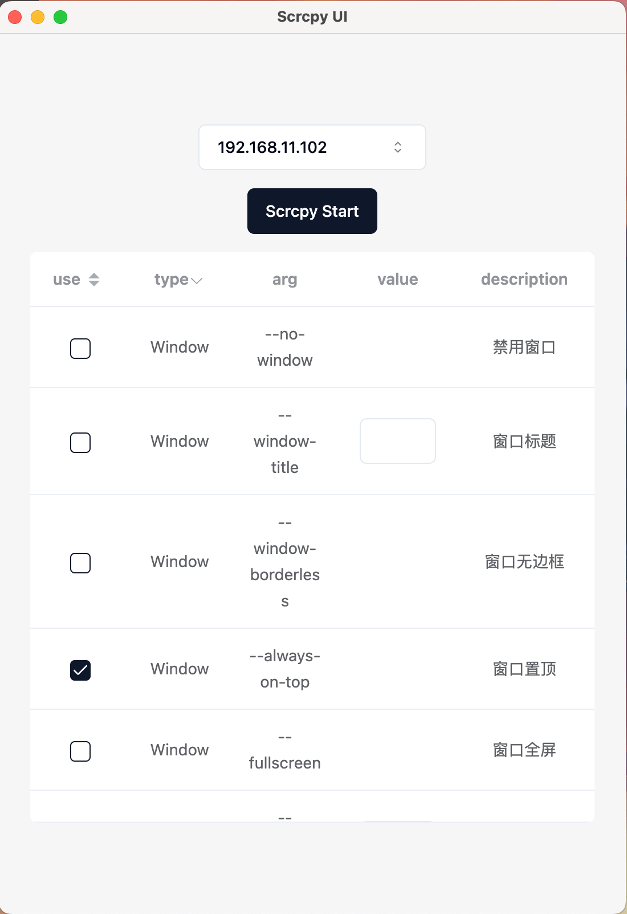

<div align="center">
	
	<br>
	<h1>Scrcpy UI</h1>
	<p>GUI application for scrcpy</p>
  <br>
  <div style="display:flex;justify-content: center;">
    
    
    
  </div>
</div>

## quick start
<div align="center">
  
  
</div>

## [scrcpy](https://github.com/Genymobile/scrcpy)
- This application mirrors Android devices (video and audio) connected via USB or over [TCP/IP](https://github.com/Genymobile/scrcpy/blob/master/doc/connection.md#tcpip-wireless), and allows to control the device with the keyboard and the mouse of the computer. It does not require any root access. It works on Linux, Windows and macOS.
- 此应用程序通过 USB 或基于 [TCP/IP](https://github.com/Genymobile/scrcpy/blob/master/doc/connection.md#tcpip-wireless)连接镜像 Android 设备（视频和音频），并允许使用计算机的键盘和鼠标控制设备。它不需要任何root权限。该应用支持Linux、Windows和macOS系统。

## Requirements
- Mac install [scrcpy](https://github.com/Genymobile/scrcpy/blob/master/doc/macos.md) and adb （mac需要先安装scrcpy和adb）
```bash
brew install scrcpy
```
```bash
brew install android-platform-tools
```

- Windows out-of-the-box with built-in scrcpy （windows可以直接使用）

## Project Setup

### Install

```bash
$ pnpm install
```

### Development

```bash
$ pnpm dev
```

### Build

```bash
# For windows
$ pnpm build:win

# For macOS
$ pnpm build:mac

# For Linux
$ pnpm build:linux
```
